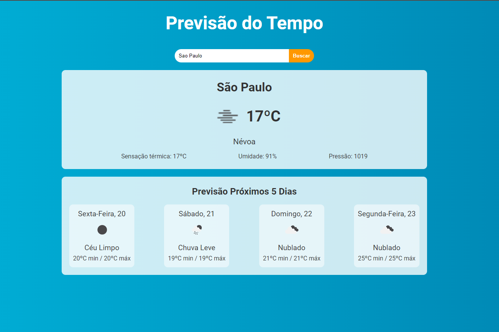

<h1 align="center"> React / Previsao do Tempo </h1>

Roberto Santos  
Desenvolvedor Web</h3>

  <a href="#tecnologias">Tecnologias</a>&nbsp;&nbsp;&nbsp;|&nbsp;&nbsp;&nbsp;
  <a href="#projeto">Projeto</a>&nbsp;&nbsp;&nbsp;

 

  

### 🚀 Tecnologias

✅ React.js
✅ Vite
✅ Node.js
✅ JavaScript
✅ Json
✅ Axios
✅ Git
✅ Github
✅ API

 

### 💻 Sobre o Projeto

O projeto Previsao do Tempo em React foi desenvovido para uma pratica em projetos usando react+vite, usando a API do site OpenWeather para receber informaçoes do clima em tempo real e dos proximos dias..

 

---

by betox.santos

